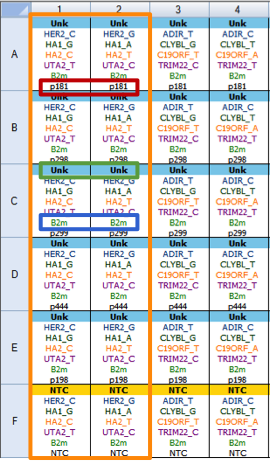
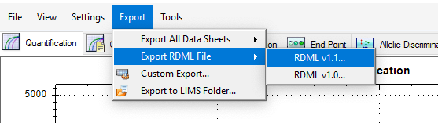
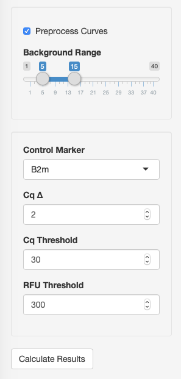
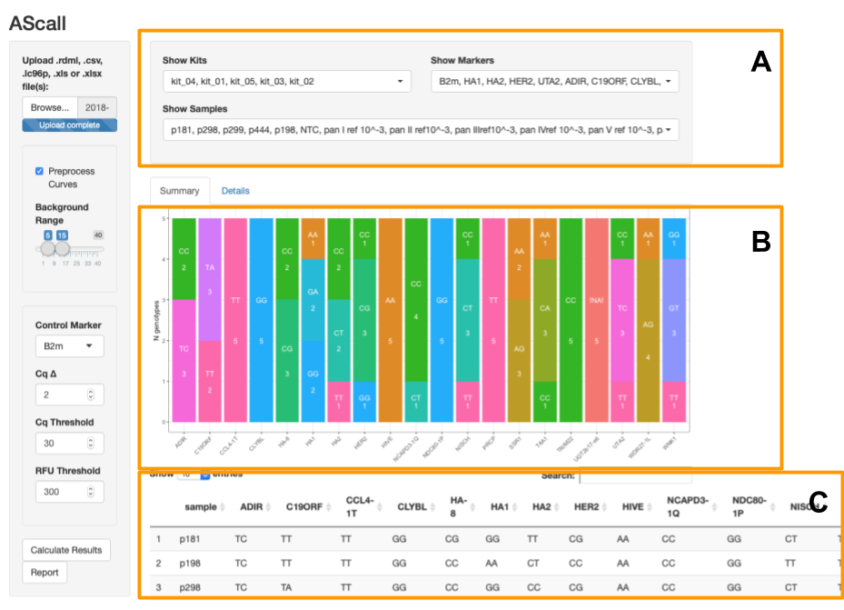
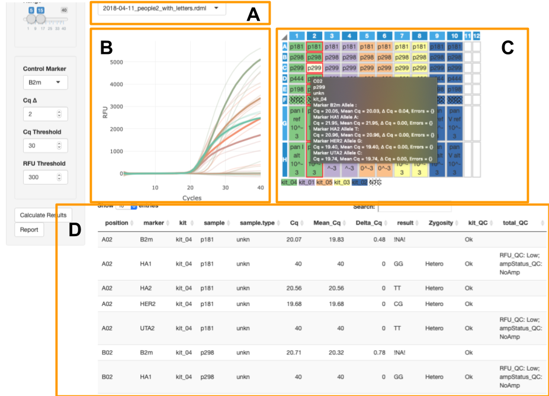

# AScall – automatic allele-specific qPCR analysis

## Introduction

AScall is a web tool providing automatic processing of allele specific real-time
PCR experiments: variation conducted real-time whereis each allele is detected 
by independent reaction separated into individual tubes. The positive outcome of
the reaction for a particular allele is judged by the increase in the 
fluorescent signal. This tool is written in R language with graphical user 
interface based on *shiny* technology. In addition to general purpose R 
packages, our program uses a number of specific PCR-oriented packages: 
[chipPCR](https://cran.r-project.org/web/packages/chipPCR/index.html),
[qPCR](https://cran.r-project.org/web/packages/qpcR/index.html),
[RDML](https://cran.r-project.org/web/packages/RDML/index.html),
[shinyMolBio](https://cran.r-project.org/web/packages/shinyMolBio/index.html).
GUI use standard *shiny* elements, 
[shinyWidgets](https://cran.r-project.org/web/packages/shinyWidgets/index.html) for 
multiply selectors - *pickerInput*, *shinyMolBio* for PCR plate - *pcrPlateInput*
and PCR curves plot - *renderAmpCurves*.

> General note: some of operations are time consuming (e.g. curves preprocession).
So be patient!!! To avoid recalculations after each option change all setup is 
applied by clicking **Recalculate Results** button.

### Installation

Copy all files (or generics.R, server.R, ui.R for minimal installation) to any
directory on your computer and 
[run](https://shiny.rstudio.com/articles/running.html) as usual *shiny*
application. All necessary packages will be installed during application run.

### Workflow overview

Process of analysis can be described by several major steps:
* data import from PCR machines via RDML format;
* optional PCR curves preprocessing;
* overall experiment quality control and individual sample control;
* sample genotype calling. 

## Data import

You can input one or more files in a format supported by the *RDML* package: 
**rdml**, **lc96p**, **xlsx**, **etc**. But *AScall* need correct sample naming 
to work as automatic genotype caller. Naming convention and export will be shown 
for *BioRad CFX Manager 3.1* as example. Several files can be imported at once – 
in such case all subsequent analyses are carried out independently for each plate
and one summary table with results is provided (control gene and preprocessing
settings will be the same for all plates!).

### Plate setup
Correct plate setup is shown on the fig.1:



There are several major elements:

* All tubes with one sample have to be **named equaly**. Marked with the red box **p181**
on the fig.1: despites the different names of targets - sample names are equal. 
Same rule for replicates - there should not be any indices!
* Target names for not control genes have to contain **gene name** and **allele name** 
after **underscore** - GENENAME_ALLELENAME pattern. Green box on the figure - 
**HER2_C** **and HER2_G** where **HER2** is the gene name and **C** or **G** are
alleles. For indel targets use **+** sign (e.g. **UGT2b17_+**). Using indel 
targets leads to alternate analysis: no amplification is deletion; amplification
is insertion.
* Control gene name have to be equal for all plates. Blue box **B2m**.
* No template controls must have **NTC** sample type.
* Target name without allele name called **marker**.
* All tubes with the same markers *AScall* interpretes as one **kit**. Orange box
on the fig.1.


### Export data from BioRad CFX Manager
After plate setup is done you can import data by **Export>Export RDML File>RDML v1.1**
menu (see fig.2).



## PCR curves preprocessing
This is optional step and only needed when your use RAW data or want to recalculate 
**Cq** values with the independent method (second derivative maximum in this case).
Preprocessing is conducted with the *chipPCR* and *qpcR* packages usage. You 
should check **Preprocess Curves** (Fig.3).



After that several additional option **Background Region** appears. You can set 
signal background region (linear part of the curves before exponentional growth)
for all curves using this slider (Click **Recalculate Results** to apply changes).

Processing consists of the following three steps:

* Background subtraction
```r
chipPCR::CPP(fpoints$cyc, fpoints$fluor,
             trans = TRUE,
             bg.range = bgRange)$y.norm
```
* Model **l5** fitting
```r
qpcR::pcrfit(fpoints[, c("cyc", "fluor")], 
       cyc = 1, fluo = 2,
       model = l5)
```
* Cq calculation
```r
qpcR::efficiency(fitted, plot = FALSE,
           type = "cpD2")$cpD2
```

## Genotype calling

### Options
After loading all data files **Recalculate Results** button appears and subsequent
analisys can be done. First of all you can fine tune several options (Fig.3):

* __Control Marker__ - select any detected marker as *control marker* - reaction that
have to be positive in all samples.
* __Cq ∆__ - maximum difference between **Cq** values of reactions replicates.
* __Cq Threshold__ - max **Cq** values to be reaction treated as positive.
* __RFU Threshold__ - minimum fluorescence signal to be reaction treated as 
positive.

### Analysis and QC steps

* Low RFU - all reactions with **RFU** lower than **RFU Threshold** are marked with 
`RFU_QC = "Low"` 
```r
RFU_QC = ifelse(endPt < input$rfuThr, 
                "Low", "Ok"))
```
* Mark amplification status - negative for reactions with `RFU_QC != "Ok"` and
**Cq** higher than **Cq Threshold**
```r
ampStatus_QC = ifelse(RFU_QC != "Ok" | cq > input$cqThr, 
                     "NoAmp", "Ok")
```
* Replicate match check - all replicates have to be `ampStatus_QC = "NoAmp"` or 
(`ampStatus_QC = "Ok"` and difference between **Cq** values lower than **Cq ∆** option)
```r
meanCq = mean(cq),
deltaCq = max(cq) - min(cq)
replicateMatch_QC = {
    if ((all(ampStatus_QC == "Ok") && deltaCq[1] < input$cqDelta) ||
        all(ampStatus_QC != "Ok")) "Ok" else "Fail"
```
* NTC no amplification - all NTC reactions in kit have to be 
`ampStatus_QC = "NoAmp"`
```r
noAmpNTC_QC = 
  {
    if (any(ampStatus_QC[sample.type == "ntc"] == "Ok"))
        "Fail" else  "Ok"
  }
```                   
* Control Marker QC - `ampStatus_QC = "Ok"` and `replicateMatch_QC = "Ok"` for 
**Control Marker** reactions
```r
ctrlMarker_QC = 
  {
    if (any(replicateMatch_QC[marker == input$ctrlMarker] != "Ok") ||
       any(ampStatus_QC[marker == input$ctrlMarker] == "NoAmp"))
            "Fail" else "Ok"
  }
```
* Kit total QC - `noAmpNTC_QC != "Ok"` for all NTC 
```r
kit_QC = 
  {
    if (any(noAmpNTC_QC != "Ok"))
      "Fail" else "Ok"
  }
```
* Results Calc - calculates for all sample which are 
`kit_QC == "Ok" & replicateMatch_QC == "Ok" & ctrlMarker_QC == "Ok"`.
Then result is a combination of alleles with `ampStatus_QC == "Ok"` or
insertion/deletion if `ampStatus_QC == "Ok"`/`ampStatus_QC != "Ok"` for
indel markers.

```r
genResult <- function(okAlleles) {
                       okAlleles <-  unique(okAlleles)
                       if (length(okAlleles) == 1) {
                         okAlleles <- c(okAlleles, okAlleles)
                       }
                       paste(okAlleles, collapse = "/")
                     }
                     
genIndelResult <- function(ampStatus_QC) {
        if (all(ampStatus_QC == "Ok")) {
          "Ins"
        } else if (all(ampStatus_QC != "Ok")) {
          "Del"
        } else {
          "Error"
        }
      }
result = {
       if (marker[1] != input$ctrlMarker) {
         if (allele[1] == "+") {
           genIndelResult(ampStatus_QC)
         } else {
           genResult(allele[ampStatus_QC == "Ok"])
         }
       } else {
         ""
       }
     }
resultZygosity =
  sapply(result,
         function(x) 
         {
           if (x[1] == "")
             ""
           else
             switch(
               as.character(str_split(x,
                                      "/")[[1]] %>%
                              unique() %>% 
                              length()),
               "1" = "Homo",
               "2" = "Hetero",
               "Error")
         })
```

## Visualization
There are three main elements:

* __Global filters__ - serve to filter kits, samples and markers for summary and
details views (fig.4A).
* __Summary view__ - global genotyping results for all PCR files.
* __Details view__ - per file view of PCR curves and plate with QC results.



### Global filters 

Global filters allow to select individual samples, markers or kits for viewing at
details and summary (fig.4A).

### Summary view

This view shows all genotyping results for all loaded files as bar plot and table.
**Barplot** allows to overview results by markers: x-axis is marker and y-axis is
number of samples grouped by genotypes of this marker (fig.4B). **Table** represents 
genotyping results by samples (fig.4C).

### Details view



This view provides access to additional per plate details about PCR curves and analysis.
It consists of:

* __File selector__ - you can switch uploaded experiments by this elements (fig.5A).
* __PCR curves__ - created by `shinyMolBio::renderAmpCurves()` function (fig.5B).
Curves are colored by _marker_.
* __PCR plate__ - created by `shinyMolBio::pcrPlateInput()` function (fig.5C).
Wells are color by _kit_; dotted wells contain NTC (see legend under plate).
Selected wells have red border and light yellow background is for _on hover_ well 
(selection filters curves on __PCR curves__ plot and the _on hover_ curves are solid 
while the others are - transparent).  __On hover__ well provides additionalinfo 
inside black box.
* __Details table__ - show information about every PCR curve including genotyping 
results and QC (fig.5D).

# Appendix: QC results

1. __RFU_QC__
  * __Low__ - curve endpoint fluorescence signal is lower than __RFU Threshold__
  * __Ok__
2. __ampStatus_QC__
  * __NoAmp__ - anmlification for this curve is not detected
  * __Ok__
3. __replicateMatch_QC__
  * __Fail__ - *Cq* difference between replicates bigger than __Cq ∆__ option
  * __Ok__
4. __noAmpNTC_QC__
  * __Fail__ - any __NTC__ sample has positive amplification
  * __Ok__
5. __ctrlMarker_QC__
  * __Fail__ - control marker does not have positive amplification in any well 
  * __Ok__
  