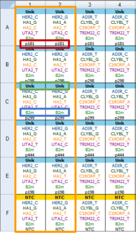

# AScall – automatic allele-specific qPCR analysis

## Introduction

AScall is a web tool providing automatic processing of allele specific real-time
PCR experiments: variation conducted real-time whereis each allele is detected 
by independent reaction separated into individual tubes. The positive outcome of
the reaction for a particular allele is judged by the increase in the 
fluorescent signal. This tool is written in R language with graphical user 
interface based on *shiny* technology. In addition to general purpose R 
packages, our program uses a number of specific PCR- oriented packages: 
[chipPCR](https://cran.r-project.org/web/packages/chipPCR/index.html),
[qPCR](https://cran.r-project.org/web/packages/qpcR/index.html),
[RDML](https://cran.r-project.org/web/packages/RDML/index.html),
[shinyMolBio](https://cran.r-project.org/web/packages/shinyMolBio/index.html).

### Installation

Copy all files (or generics.R, server.R, ui.R for minimal installation) to any
directory on your computer and 
[run](https://shiny.rstudio.com/articles/running.html) as usual *shiny*
application. All necessary packages will be installed during application run.

### Workflow overview

Process of analysis can be described by several major steps:
* data import from PCR machines via RDML format;
* optional PCR curves preprocessing;
* overall experiment quality control and individual sample control;
* sample genotype calling. 

## Data import

You can input one or more files in a format supported by the *RDML* package: 
**rdml**, **lc96p**, **xlsx**, **etc**. But *AScall* need correct sample naming 
to work as automatic genotype caller.Naming convention and export will be shown 
for *BioRad CFX Manager 3.1* as example.

Correct plate setup is shown on the fig.1:

There several major elements:

* All tubes with one sample have to be **named equaly**. Marked with the red box **p181**
on the fig.1: despites the different names of targets - sample names are equal. 
Same rule for replicates - there should not be any indices!
* Target names for not control genes have to contain **gene name** and **allele name** 
after **underscore** - GENENAME_ALLELENAME pattern. Green box on the figure - 
**HER2_C** **and HER2_G** where **HER2** is the gene name and **C** or **G** are
alleles.
* Control gene name have to be equal for all plates. Blue box **B2m**.
* No template controls must have **NTC** sample type.
* All tubes with the same targets *AScall* interpretes as one **kit**. Orange box
on the fig.1.

